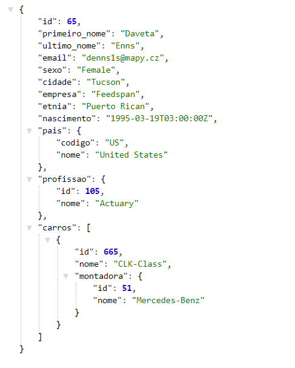
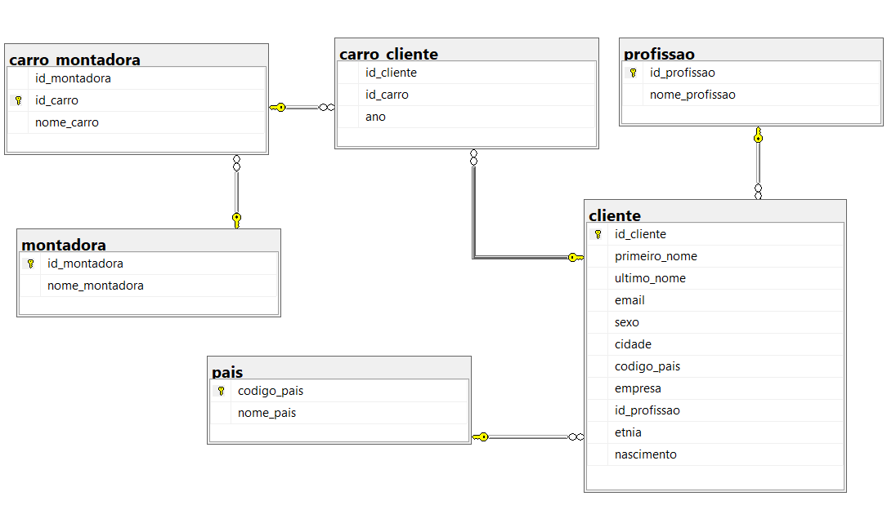

# api-crm-database
Uma API (Application Programming Interface) seguindo o padrão REST desenvolvida com a framework Java Spring.
A API se conecta com um banco de dados CRM (Customer relationship management) que contém as informações dos clientes de uma empresa fictícia e realiza as operações de <b>CRUD</b> via protocolo HTTP retornando respostas em formato JSON. 

<b>Exemplo de operação GET:</b> localhost:8080/api/clientes/65  

# Modelo do banco de dados CRM
O modelo abaixo determina as relações das entidades. 
